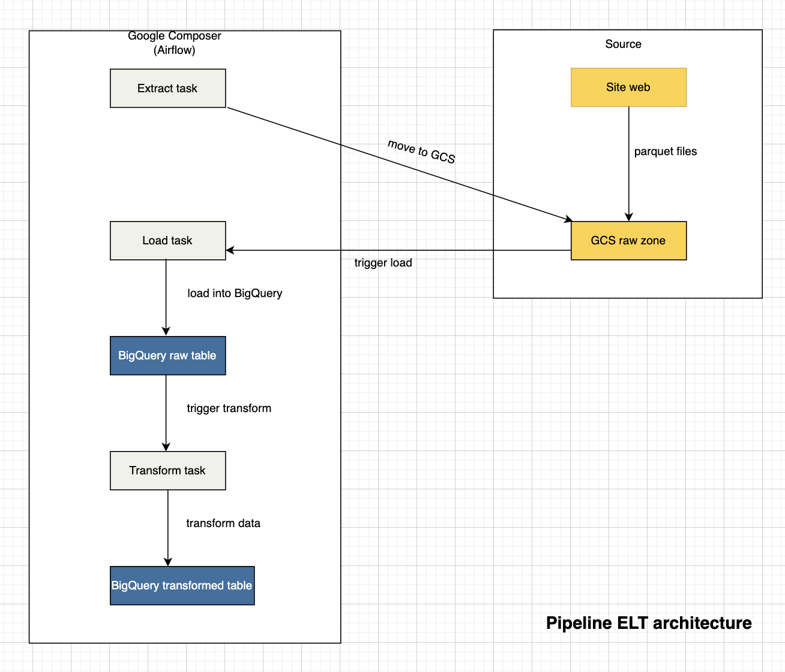

# 🏆 yellow-taxi-trips-analytics

This involves designing and deploying a complete ELT pipeline on Google Cloud Platform, automating data processing and harnessing the power of the cloud for analysis.

## ☁️ Architecture


## 🛠️ Technical environement

- GCP (Google Cloud Platform)

The Google Cloud Platform is the platform that brings together Google's various cloud services.
It comprises a family of products, each with a web interface. For more details, click [here](https://cloud.google.com/docs/overview?hl=fr)

- BigQuery

It is a very large-scale data warehouse. [More](https://cloud.google.com/bigquery?hl=fr)

- Cloud Shell

It's an environment that lets you code or use a terminal directly in your browser. [More](https://cloud.google.com/shell?hl=fr)

- Cloud Storage

It's an online file storage system. [More](https://cloud.google.com/storage?hl=fr)

- Cloud composer

It's a fully managed workflow orchestration service built on Apache Airflow. [More](https://cloud.google.com/composer?hl=fr)

- SQL

SQL (Structured Query Language) is a popular query language frequently used in all types of applications. [More](https://sql.sh/)

- Python

Python is a general-purpose programming language created in 1989 by Guido van Rossum. [More](https://www.python.org/)


<!--## *️⃣ Project structure-->

## 💻​ Environment setup
- Get the project and launch the program

In your terminal,
```sh
git clone https://github.com/Desy16/yellow-taxi-trips-analytics.git
cd yellow-taxi-trips-analytics.git

python3 -m venv .venv
source .venv/bin/activate
pip install -r requirements.txt
```

## 👨‍💻​ Author
[Desty MPASSI MATONDO](https://github.com/Desy16/yellow-taxi-trips-analytics)